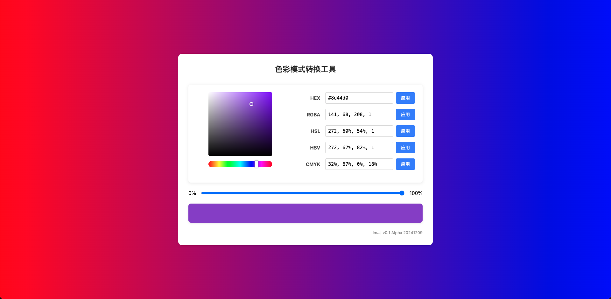

# 色彩模式转换工具

一个简洁、直观的基于网页的色彩模式转换工具，支持多种色彩格式之间的实时转换。



## 功能特点

- 基于 Figma 风格的色彩选择器
  - 色相滑块：选择基本颜色色相
  - 色彩方块：调整所选色相的饱和度和亮度
- 支持多种色彩格式之间的实时转换：
  - HEX（十六进制）：支持 #RGB、#RGBA、#RRGGBB、#RRGGBBAA
  - RGBA（红绿蓝透明度）
  - HSL（色相饱和度亮度）
  - HSV（色相饱和度明度）
  - CMYK（青黄品黑）
- 透明度调整滑块
- 实时色彩预览
- 自动输入格式转换：在任一格式输入框中输入即可自动更新其他格式
- 响应式设计：适配桌面和移动设备

## 使用方法

### 选择颜色

1. 使用水平色相滑块选择基本颜色
2. 在色彩方块中点击或拖动来调整饱和度和亮度
3. 使用透明度滑块调整颜色的透明度

### 颜色格式转换

- 在任意格式的输入框中直接输入颜色值，其他格式会自动更新
- 也可以通过点击"应用"按钮应用输入的颜色值
- 支持的格式示例：
  - HEX: `#FF5500`、`#F50`、`#FF5500FF`、`#F50F`
  - RGBA: `255, 85, 0, 1.0`
  - HSL: `20, 100%, 50%, 1.0`
  - HSV: `20, 100%, 100%, 1.0`
  - CMYK: `0%, 67%, 100%, 0%`

## 浏览器兼容性

- Chrome / Edge（最新版本）
- Firefox（最新版本）
- Safari（最新版本）
- 现代移动浏览器

## 技术实现

- 纯原生 JavaScript 实现，无第三方依赖
- CSS3 实现渐变和交互效果
- 响应式设计适配不同屏幕大小

## 文件结构

```
/color-converter
├── index.html      # 页面结构
├── styles.css      # 样式定义
├── script.js       # 交互逻辑和颜色转换算法
└── README.md       # 项目说明文档
```

## 本地运行

1. 克隆或下载此仓库
2. 直接在浏览器中打开 `index.html` 文件
3. 或使用本地服务器（如 Live Server）运行项目

## 未来计划

- 添加颜色历史记录
- 颜色保存和导出功能
- 支持更多颜色格式（如 HSB、LAB 等）
- 颜色对比度检测工具

## 版本历史

- v0.1 Alpha (2024-12-09): 初始版本，实现基本功能

## 许可证

MIT
